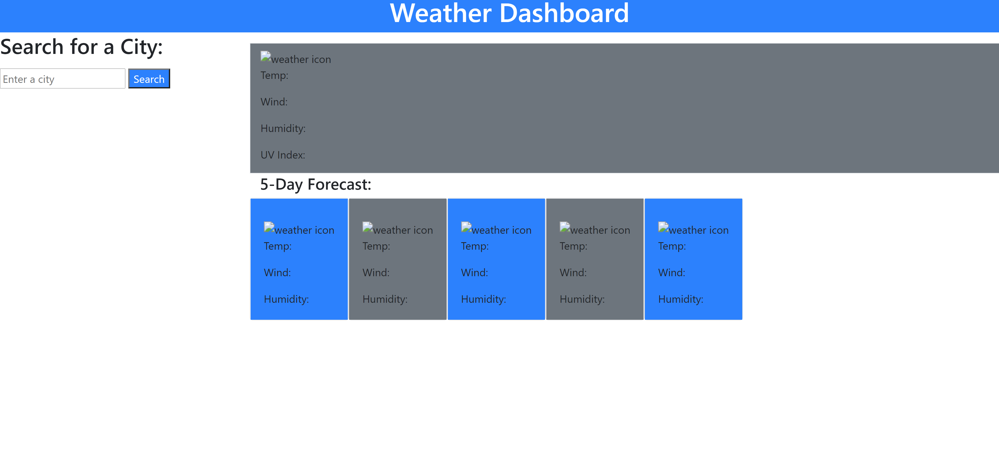

# Weather Dashboard

## Description 
I wanted to build an application that helps users view the day's current weather conditions, as well as a five day forecast for the given city searched! I wanted to create this website to aid users in planning for the day and week ahead of them. In this project, I was also able to demonstrate my skills using REST APIs. I used three different APIs in this project in order to add the dynamic data to it. I also used Bootstrap classes in the HTML for a simple but sleek layout and put it all together with JavaScript! Enjoy the application and use it to plan for the weather! 

### Application 

[Use the Weather Dashboard!](https://davidjaguilar104.github.io/weather-dashboard/)

#### Technologies Used
* HTML
* CSS
* JavaScript
* Moment.js
* Bootstrap
* Fetch API
* Geocoding API
* OpenWeather One Call API
